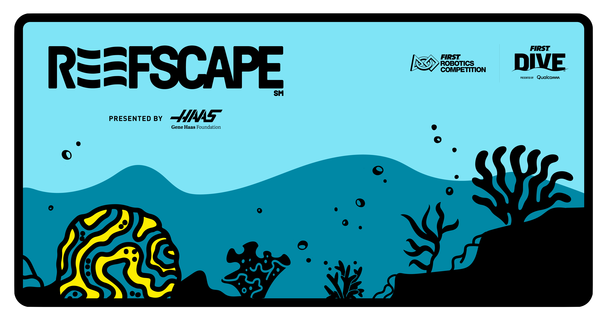

# FlyingToasters2025 (Public)

This project contains the Flying Toaster's robot code for the 2025 FRC game - REEFSCAPE. Check out 3641's [open alliance thread](https://www.chiefdelphi.com/t/frc-3641-the-flying-toasters-2025-build-thread-open-alliance/476632) on Chief Delphi to follow up on our development, or look for 3641's code for our [strategy database](https://github.com/FlyingToasters3641/ScoutingDatabase2025). For other documentation, browse 3641's new [documentation site](https://flyingtoasters3641.github.io/Toasty_Docs/).

This repository is updated with our latest buildable code. For any feedback or questions, please see our [open alliance thread](https://www.chiefdelphi.com/t/frc-3641-the-flying-toasters-2025-build-thread-open-alliance/476632). Good luck to all the teams this year!

